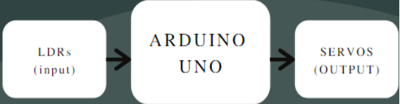
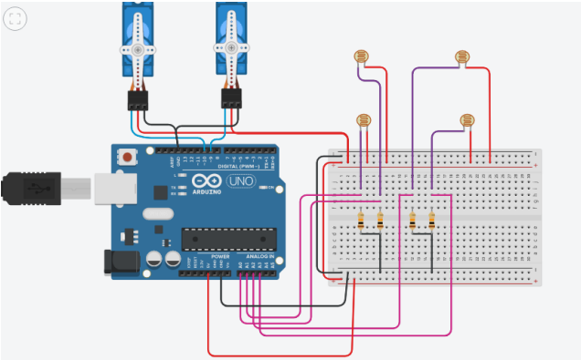
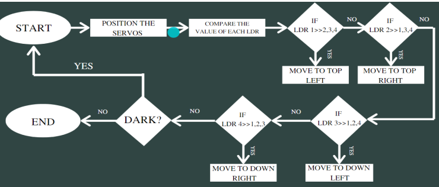
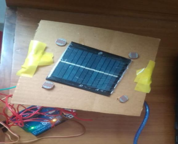

**DUAL AXIS SOLAR TRACKER USING ARDUINO NANO**

A dual axis solar tracker that adjusts its position according to the direction from which sunlight is received.

**Model/Methodology**

To sense the light four LDRs ( Light dependent resistor ) are used. They are fixed on the four corners of the solar panel. Servo motors are used as actuators. Two of them are used; one for vertical and another for horizontal inclination. Arduino Uno microcontroller is used for control
of the whole system. 5V supply is given to both LDR and Servo motors from the Arduino.
Model

**Model Circuit Diagram**

**Components used**

1. Arduino Uno
2. LDR
3. Micro Servo
4. Resistors

**Working Mechanism**

Based on the intensity of light, LDRs give signals to analog inputs of arduino. ADC in the arduino converts it to digital signals which makes the servos move. Servos are connected in two different positions, thereby dual axis rotation is possible.

**Algorithm**

**Hardware Setup/ experimental setup**

